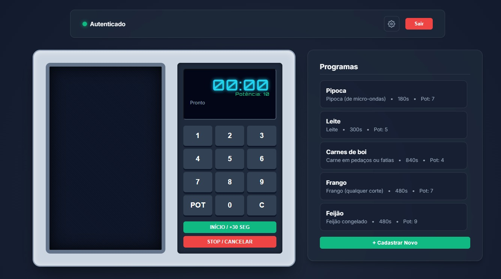

# Simulador de Micro-ondas Digital

Simulador de micro-ondas desenvolvido para avaliação técnica, focando na aplicação rigorosa de padrões de projeto, SOLID e Clean Code.

---

## 📸 Visual da Aplicação (Nível 4)



---

## Tecnologias e Frameworks
- **Linguagem:** C# (.NET 10.0)
- **Interfaces:** Web UI (Vanilla JS) e Console Application
- **Persistência:** Entity Framework Core (SQL Server via Docker)
- **Testes:** xUnit, Moq, FluentAssertions, Bogus
- **Padrões:** Orientação a Objetos, SOLID, TDD, Clean Code

## Decisões Arquiteturais e Padrões (Nível 1)

Durante o Nível 1, algumas decisões arquiteturais chaves foram tomadas para priorizar o design de software limpo:

1. **Aplicação Console:** A fim de focar estritamente nas regras de negócio (Backend) sem ferir a separação de responsabilidades criando acoplamentos prematuros de UI Web ou Web APIs, a interface visual inicial foi construída via Terminal interativo. 
2. **SOLID e Orientação a Objetos:** A classe `MaquinaMicroondas` foi desenhada como uma Entidade rica de Domínio. Utilizamos `private set` para blindar o estado da máquina. Toda mutação ocorre através de métodos de negócio que protegem as invariantes do processo de aquecimento.
3. **Clean Code:** O código flui linearmente usando as técnicas de *Early Return* e *Guard Clauses*, melhorando drasticamente a legibilidade.
4. **Padrão Builder (Testes):** Os testes em xUnit utilizam o design pattern *Test Data Builder* com auxílio do `Bogus`, herdando de um `BaseBuilder<T>` para geração padronizada de entidades.

## Decisões Arquiteturais e Padrões (Nível 2)

Durante o Nível 2 (Programas Pré-definidos), as seguintes abordagens foram aplicadas para suportar a complexidade e garantir a extensibilidade:

1. **Padrão Repository:** Para manter um código limpo e preparar o terreno para a persistência em banco de dados, o acesso aos programas ocorre de forma abstraída através da interface `IProgramaRepository`.
2. **Desacoplamento e Separação da UI:** O monolítico inicial da UI foi fracionado. A apresentação visual agora está concentrada na classe `MicroondasVisor`, enquanto o roteamento de escolhas via teclado e inputs são domínios da classe `MicroondasMenu`.
3. **Eliminação de Magic Numbers:** A classe `ValoresPadrao` foi estendida para centralizar rigorosamente tempos e potências de todos os 5 programas de nível 2, deixando a parametrização visível num único local do sistema.

## Decisões Arquiteturais e Padrões (Nível 3)

A evolução para o Nível 3 consolidou a estrutura backend para um cenário real de mercado:

1. **Persistência com EF Core e Docker:** Implementação de um banco de dados relacional SQL Server containerizado via Docker, mantendo o ambiente de desenvolvimento limpo e previsível.
2. **Refatoração do Domínio (Composição sobre Herança):** O modelo abstrato baseado em herança foi substituído por uma única entidade rica `ProgramaAquecimento` com a propriedade `EhPadrao`. Isso evita complexidade desnecessária e permite persistir todos os programas em uma única tabela fluida.
3. **Arquitetura Totalmente Assíncrona:** A aplicação inteira foi reescrita utilizando o padrão `async/await`, desde o repositório até o loop principal do Console UI, simulando o comportamento não-bloqueante de Web APIs modernas.

## Decisões Arquiteturais e Padrões (Nível 4 - Web API & UI)

A conclusão do projeto com o Nível 4 transforma a aplicação em uma solução Full-Stack, com foco em segurança, padronização de respostas e interface gráfica.

1. **ServiceResult Pattern e Middleware:** Os retornos dos serviços de negócio foram padronizados usando um `ServiceResult<T>`. As exceções residuais do domínio são tratadas de forma elegante pelo `ExceptionHandlerMiddleware`, unificando as respostas de erro da API.
2. **Controllers Autenticadas (JWT):** A exposição dos serviços foi feita via Web API RESTful protegida pelo esquema *Bearer Token*. Somente acessos autorizados conseguem interagir com o micro-ondas.
3. **Segurança de Credenciais:** As senhas e hashes foram trabalhados sob o padrão **SHA-256**. O requisito 138 mencionava "SHA1 (256 bits)", o que é uma contradição técnica (SHA1 possui 160 bits). Optou-se por utilizar SHA-256 para garantir a especificação de 256 bits e segurança moderna. A connection string do banco de dados encontra-se protegida por criptografia **AES-256**.
4. **Interface Web (HTML/CSS/JS):** Desenvolvida como uma **camada de apresentação opcional** para facilitar a validação visual do recrutador. Ela demonstra o poder do desacoplamento: o mesmo backend que serve o Console atende a Web UI via API, mantendo paridade absoluta de regras e comportamento.

---

## 🛠️ Memorial de Refinamentos (Evolução Técnica)

Esta seção documenta os ajustes realizados durante a fase final de polimento para garantir a máxima aderência aos requisitos de negócio e excelência técnica:

### Nível 1 - Refinamento de Input
- **Validação Imediata:** Corrigida a experiência do console onde a validação ocorria apenas ao final do fluxo. Agora, cada campo (tempo/potência) é validado no instante do input, garantindo feedback instantâneo ao usuário.

### Nível 2 - Fidelidade aos Programas
- **Revisão de Instruções:** Ajuste nas mensagens de instrução dos programas pré-definidos para garantir 100% de paridade com os requisitos técnicos, corrigindo pequenas divergências de texto.

### Nível 3 - Integridade de Regras de Negócio
- **Acúmulo de Tempo (+30s):** Refatoração da lógica de Início Rápido no Domínio. O sistema agora realiza o acúmulo (soma) de 30 segundos se a máquina estiver em operação, em vez de apenas resetar o tempo, respeitando as regras de limite.
- **Consistência de Visor:** Unificação da lógica de formatação de tempo no backend, garantindo que a regra de conversão para `m:ss` (acima de 60s) seja aplicada de forma centralizada e consistente em todas as interfaces.

---

## 🔐 Segurança e Configuração

### Connection String (Descriptografada)
A connection string está criptografada no arquivo `appsettings.json` para segurança em produção. Para ambiente de desenvolvimento local, ela se resolve para:

```
Server=localhost,1433;Database=MicroondasDb;User Id=sa;Password=YourSAPassword123!;Encrypt=false;TrustServerCertificate=true;
```

**Nota:** Esta é apenas a connection string descriptografada para referência. No arquivo de configuração, ela está protegida por criptografia AES-256.

### Credenciais Padrão
- **Usuário:** `admin`
- **Senha:** `123456`

Essas credenciais são seeded no banco de dados na primeira migração e podem ser alteradas diretamente na tabela `Usuarios` para um ambiente de produção.

---

## 🚀 Como Instalar e Usar

### 1. Preparar o Ambiente (Banco de Dados)
```powershell
docker-compose up -d
```

### 2. Escolha sua Interface
Ambas as opções abaixo compartilham o mesmo banco de dados e as mesmas regras de domínio centralizadas no backend.

#### Opção A: Web API + UI (Apresentação Facilitada)
Interface gráfica opcional criada para uma experiência visual fluida.
```powershell
dotnet run --project Microondas.Api
```
- **Acesso:** `http://localhost:5000/` (User: `admin` | Pass: `123456`)

#### Opção B: Console Application (Base Original)
O simulador raiz via terminal, ideal para validar a lógica de negócio pura.
```powershell
dotnet run --project Microondas.Console
```

---

## 🧪 Suíte de Testes
```powershell
dotnet test
```

---
> Challenge by [Coodesh](https://coodesh.com/)
